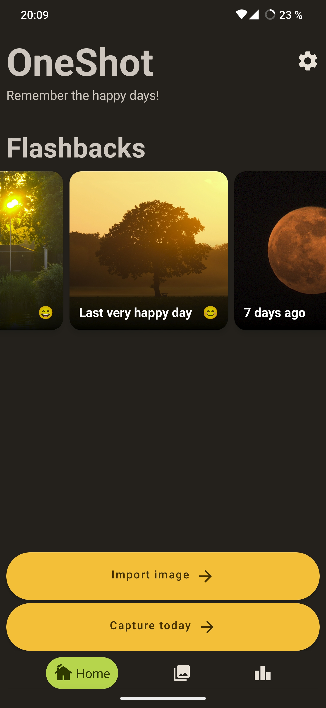
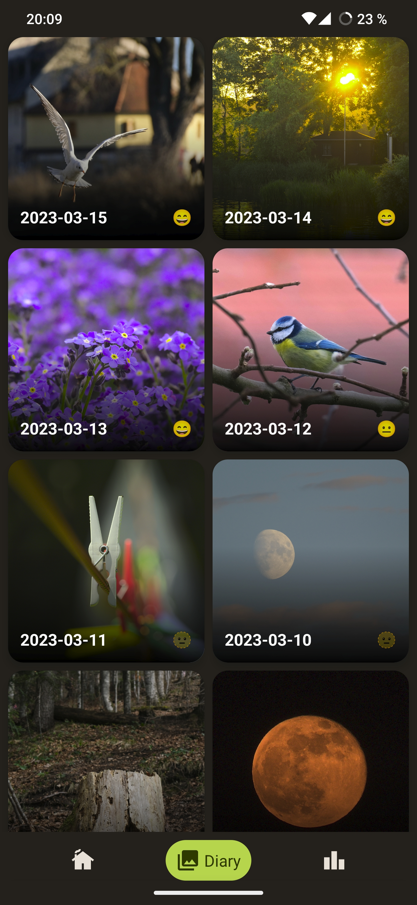
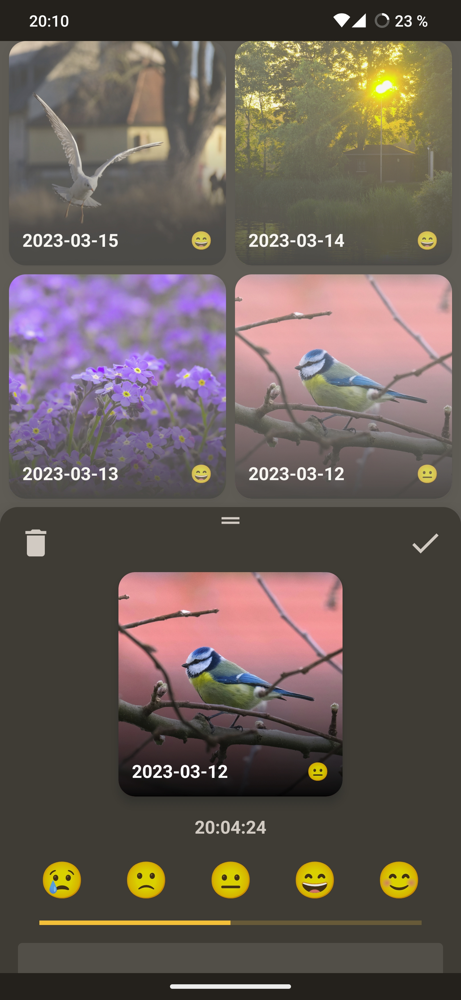
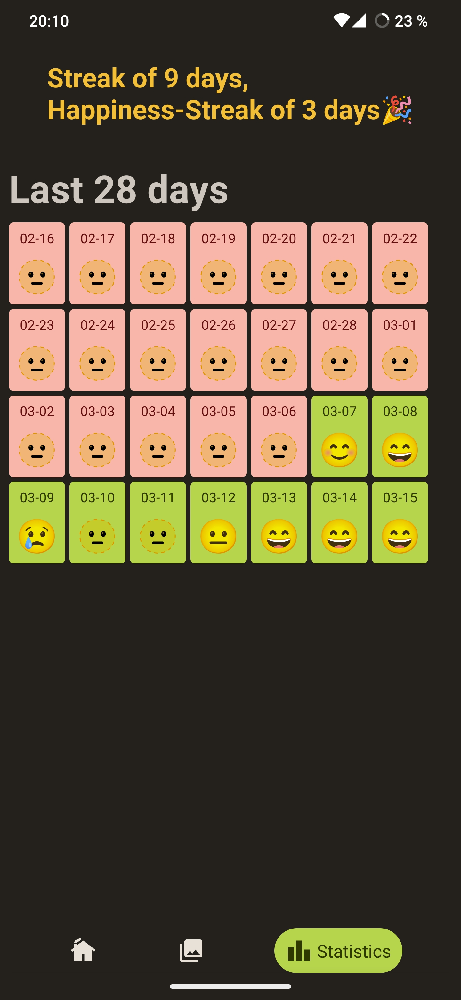

<h1 align="center">
     
    
     
    OneShot
     
</h1>

<!-- <h1> 

# OneShot

</h1>

**Remember the happy days!**

 

 -->

 

OneShot is made to remind you of the special moments. Because every day has at least one. And that's what counts in life! So make it your habit and **remember the happy days!**

---

## Downloads

[</img>](https://f-droid.org/it/packages/de.ptrlx.oneshot/)

## Features

OneShot is a simple but private android photo diary app (>= android 10) written in Kotlin and Jetpack Compose.  
You can capture one entry per day, write your diary and store your happiness.  
It stores your photos in a local folder and your diary within the app. Import and export to JSON is possible.

 

 

Thank's to [@Cynog](https://github.com/Cynog) for providing the beautiful images in the screenshots!

## Translation

OneShot is currently available in following languages:

* English
* German

## Privacy

Your data is yours!
OneShot will not send data to any server without your consent.
The app requires currently no internet permission.

## License

This app is made with passion and love by ptrLx️.
It is free software released under GPLv3 and comes with absolutely no warranty!

## Open Source Licenses

Coil - Apache License Version 2.0  
Dagger - Apache License Version 2.0  
Accompanist - Apache License Version 2.0

## Inspiration

Thanks to the great work of following projects that inspired me and helped me learning!

* <https://github.com/philipplackner/CleanArchitectureNoteApp>
* <https://github.com/philipplackner/BottomNavWithBadges>
* <https://github.com/philipplackner/MeditationUIYouTube>
* <https://m3.material.io/theme-builder#/custom>
* <https://semicolonspace.com/jetpack-compose-topappbar-menu-icons>
* <https://github.com/developerchunk/CustomNavBar-Jetpack-Compose>
